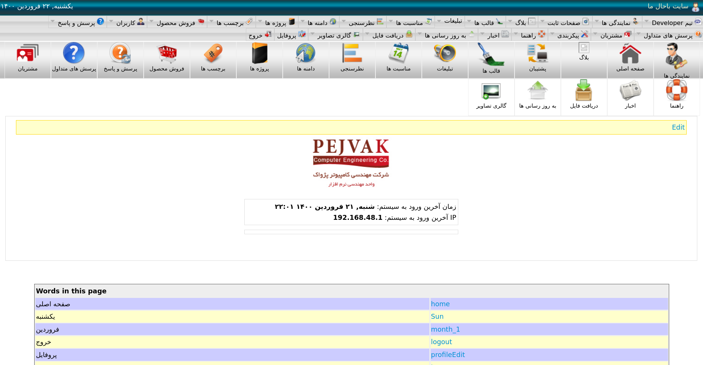

# Moji-cms
A modular php based content management system

**Notice: This code is written in 2009 with php 5.4 and needs a bit of love to make it compatible with the latest php version**
I just put it together in a docker compose format so it can be easier to use.



### Features
- Modular
- User management and Access control (Module based and action based)
- Template management (all stored in DB)
- Supports multiple languages both for content and labels
- Support multiple domains in such a way that several domains can be parkes on the same host and different content will show for each with dedicated template and all can be managed through one admin panel
- Data Export and Import
- Autonomous Cache system for database queries and templates

### Installation

1. Simply clone the repo and run docker compose:
```
git clone https://github.com/mojtaba-esk/Moji-CMS-php.git Moji-CMS-php
cd Moji-CMS-php
sudo chmod 0777 -R ./www/cache/
sudo docker-compose up -d
```

2. Then open phpmyadmin via this URL: http://localhost:8081/

create a new database with this name: `mojicms_db`


_You can choose your own name as well, but then you need to modify `.env` file_

3. Import datbase tables to the database. The BD backup file can be found under `DB` folder:


4. The next step is to fix mysql user authentication to make it compatible with the latest version. Simply open user account on phpmyadmin and change the password for the default user which is `dev` and the password is also `dev`. Again you can change it in `.env` file. Make sure to select `Native MySQL authentication` for `Password Hashing` just like the photo below:


5. Then if all run you can access to the CMS through this URL: http://localhost:8080/

Please feel free to fork it and extend it if you find it useful.

Cheers,
Moji
